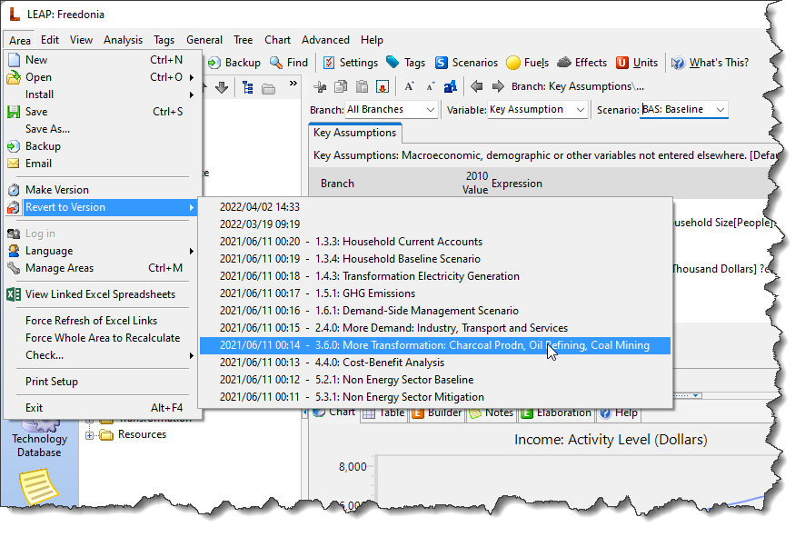
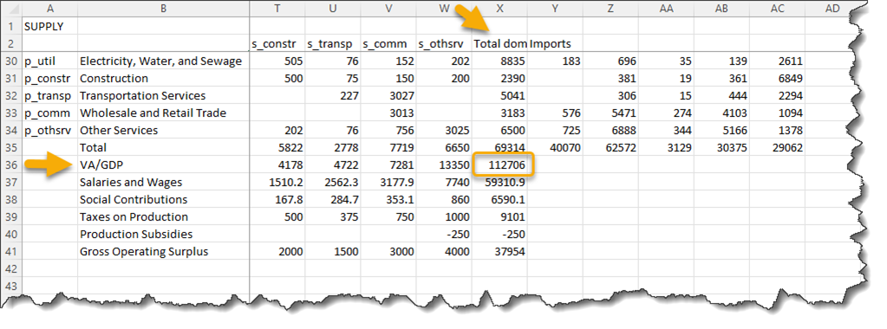
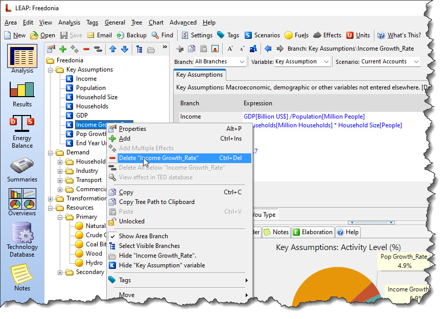
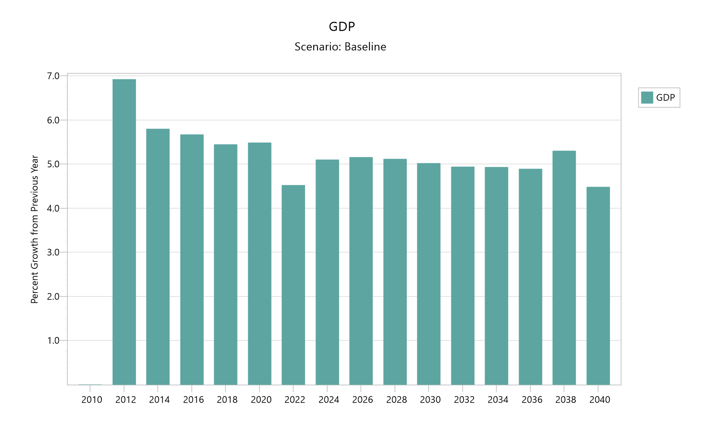
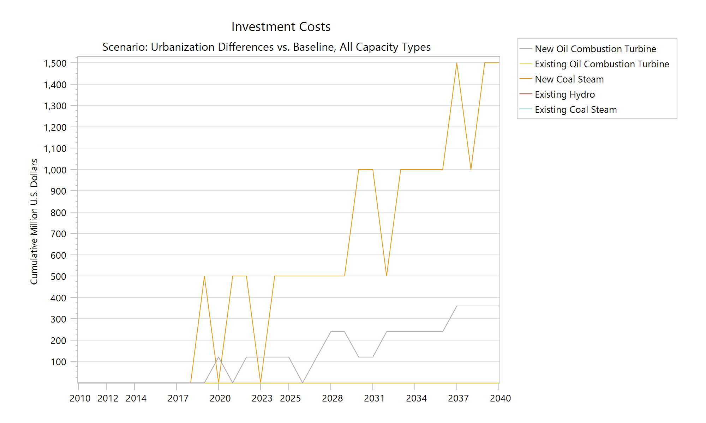

```@meta
CurrentModule = LEAPMacro
```

# [LEAP exercise](@id leap-exercise)
In this exercise you are going to add a macroeconomic model to LEAP using the LEAP-Macro module. First, you will run a set of macroeconomic scenarios. Then, you will introduce investment costs and run a set of alternative investment scenarios.

Make sure you start with a data set that has all of the data entry completed through LEAP Exercise 3.

!!! warning "Pre-requisites"
    For this exercise, you must have a licensed version of LEAP: see the [LEAP](https://leap.sei.org/) website for details. Registered users can find additional exercises on the LEAP website. You must also [install LEAP-Macro](@ref installation). To make sure the installation was successful, it is best to follow the [Quick Start](@ref quick-start)  instructions before running this exercise.

## Getting ready
There are a few preparatory steps required before modifying the Freedonia LEAP area.

### Prepare the Freedonia area
First, open the Freedonia area and revert to version 3.6.0: More Transformation. Then, save your changes, close LEAP, and keep it closed during the next steps.



### Move the Freedonia LEAP-Macro files to the LEAP Areas folder
As explained under [Quick Start](@ref quick-start), a full Macro model for the Freedonia LEAP area is available in a zip file called `Macro.zip`. Unzip the file and save the contents in a new sub-folder within the Freedonia LEAP Areas folder, following these steps:
1. Copy Macro.zip into the `LEAP Areas\Freedonia` folder
2. Unzip the files into a folder called `Macro`

!!! info "The LEAP Areas folder"
    Normally the LEAP Areas folder is located in your Windows user’s _Documents_ folder. To verify the location on your computer, open LEAP and look in `Settings > Folders > Areas`.


## Modifying LEAP
The next steps involve modifying LEAP so that it can interface with the Macro model. Not many changes are needed, and all of them are in Key Assumptions.

First, start LEAP. Next, in **Analysis View**, open the _Key Assumptions_ branch and change to Current Accounts:


### Entering GDP and calculating income
In the current implementation, the Key Assumption “Income” is input data, while “GDP” is calculated. However, the Macro model will calculate an index for GDP, so you will need to reverse this.[^1]

To determine an appropriate value for GDP, open the [supply and use table file](@ref sut) and look for total value added, because that is equal to GDP. It is easiest to do that using Excel’s “freeze panes” feature. For this file, total value added is in cell X36, and is equal to 112706. The values in this file are in millions of US\$, while the GDP entered in LEAP is in billions of US\$. So, dividing this value by 1000 gives 112.7 billion US\$.



So, for the first change, **enter 112.7 into Key Assumption “GDP”** and save the LEAP area:


Next, calculate Income as GDP divided by population:


Also remove the expression for Income in the Baseline scenario, so that it will default to the Current Accounts expression:


Finally, because the “Income Growth_Rate” Key Assumption is no longer used, you can delete it:



[^1]: Actually, Macro calculates value added in non-energy sectors, since LEAP is taking care of the energy sectors. An index of total non-energy value added is used as a proxy for an index of GDP growth.

### Changing the population growth rate
In the standard Freedonia model, population growth is steady across the entire scenario. More realistically, population growth can be expected to slow as incomes increase. To allow for a changing population growth rate, enter the following into the Baseline scenario for the “Pop Growth_Rate” Key Assumption:
```
InterpFSY(2015, 2.55, 2020, 2.50, 2025, 2.41, 2030, 2.28, 2035, 2.16, 2040, 2.03)
```


### Adding Employment to Key Assumptions
Macro calculates an index for employment. It is not necessary to read that into LEAP, since it is not used in any LEAP calculations. However, it is an interesting policy variable, so go ahead and add it to the Freedonia model:


Enter a value of 22 million people for Current Accounts: 


### Adding investment costs
In the configuration file for Macro, the sectors Coal Mining (s_coal), Petroleum and Natural Gas (s_petr) and Electricity, Water, and Sewage (s_util) are excluded from the calculations, on the understanding that they are tracked in LEAP. That means that Macro will not estimate investment expenditure for those sectors, which can be an important source of demand, which affects economic output and energy demand. When energy-related investment costs are included in the model, they are collected and added to total investment demand in the Macro model. LEAP and Macro are run iteratively to convergence.

To add investment costs, first switch on costing by going to the Scope & Scale tab of the **Settings** screen and enable **Costs**. The Costs tab will become active. The settings on the Costs tab do not affect the link to the Macro model, so you can close the dialog.

Make sure you are in Current Accounts. Then, go to the “Transformation\Electricity Generation\Processes” branch and select the **Capital Cost** variable. Relevant values are in the table below. Make sure that the units are either US\$/kW or, equivalently, 1000 US\$/MW.

| Type of plant | Capital cost (\$/kW) |
|:--------------|---------------------:|
| _Existing Plants_ ||
| Existing Coal Steam | 1000 |
| Existing Hydro | 2000 |
| Existing Oil Combustion Turbine | 400 |
| _New Plants_ ||
| New Coal Steam | 1000 |
| New Oil Combustion Turbine | 400 |

## Running LEAP-Macro
LEAP-Macro can be run using a Visual Basic script that is provided with the sample files. Go into the _LEAP Areas\Freedonia\Macro_ folder and open the _LEAP Areas\Freedonia\Macro\scripts_ folder. Copy the `LEAPMacro_MacroModelCalc.vbs` file from that folder into the main Freedonia LEAP area folder.

Before running the file, edit the [configuration file](@ref config) `LEAPMacro_params.yml` to set the parameter `run_leap` to `true`:
```yaml
model:
    # Set run_leap to "false" to do a single run of the Macro model without calling LEAP
    run_leap: true
    # Hide LEAP while running to (possibly) improve performance
    hide_leap: false
    # Maximum number of iterations before stopping (ignored if run_leap = false)
    max_runs: 7
    # Tolerance in percentage difference between values for indices between runs
    max_tolerance: 1.0 # percent
```
If you copied the Visual Basic script correctly, then it should be accessible from the `Advanced > Run Area Script` menu. Select it and run it. You may need to give LEAP permission to run the script.


After a delay while the program loads, it will begin running the model. It may do multiple runs:


### Examining the results
Change to the Results view in LEAP, and look at the results for the _Key\GDP_ branch. They should now reflect the index calculated by the Macro model.


To get a better idea of how GDP is changing, click on “More…” and select “Growth Rates” rather than absolute values. The results show that the growth rate calculated by the Macro model starts high and then gradually declines. There is a slight drop after 2020, because the global GDP trajectory specified in the input files, which is a driver of export demand, takes into account the impact of COVID-19.

The initial target growth rate in the configuration file was set to 6%/year, the same as the assumption in the original Freedonia model, and GDP growth stays near that level. However, due to internal model dynamics and some demand constraints, it stays below that level, and in fact declines less than 5%/year by the end of the scenario.



Other results are passed to LEAP as well, including an index of industrial activity. To see it, go to the **Results View** and select the _Demand\Industry\Iron and Steel_ branch. Change the displayed variable from **Activity Level** to **Total Activity**, and select “Absolute Values” instead of “Growth Rates” in the box above the chart. Next, click on the “Denominator…” button and select GDP. The results show that the Iron and Steel sector generally grows more slowly than GDP, reflected in the downward slope of the line.


!!! tip "Detailed results from LEAP-Macro"
    To see more of the results, open the _LEAP Areas\Freedonia\Macro_ folder under the Freedonia LEAP area. There you will find all of the [output files](@ref model-outputs) produced by the Macro model.

## Changing urbanization: A new scenario
With a few modifications, the LEAP-Macro model can be used to compare different scenarios. For this example, you will change the urbanization assumption in Freedonia. Urban households use electricity at a different rate than do rural households, so changing the urbanization assumption will change household electricity demand.

To create the new scenario, go to the **Scenarios** screen in LEAP and create a new scenario below the Baseline scenario called “Urbanization”.


Close the Scenarios screen, and change to the Urbanization scenario. Then, go to the _Demand\Household\Urban_ branch and alter the expression in the _Activity Level_ variable to read
```
Interp(2040, 60)
```
With this assumption, the urbanization rate will rise to 60% by the end of the scenario, rather than the Baseline value of 45%.

Next, make a copy of the [configuration file](@ref config) and rename it to `LEAPMacro_params_URB.yml`. In the new file, make three changes:

First, name a new output folder for this scenario, “Urbanization”:
```yaml
#---------------------------------------------------------------------------
# Folder inside the "outputs" folder to store calibration, results, and diagnostics
#---------------------------------------------------------------------------
output_folder: Urbanization
```
Second, change the LEAP scenario to “Urbanization”:
```yaml
#---------------------------------------------------------------------------
# Parameters for running LEAP with the Macro model (LEAP-Macro)
#---------------------------------------------------------------------------
# Core information for the LEAP application (optional)
LEAP-info:
    # The last historical year (equal to LEAP's First Scenario Year - 1): if missing, it is set equal to the start year
    last_historical_year: 2010
    # This can be, e.g., a baseline scenario (alternatively, can specify input_scenario and result_scenario separately)
    scenario: Urbanization
    # The region (if any -- can omit, or enter a "~", meaning no value)
    region: ~
```
Third, edit the `LEAP-Macro-run.jl` file that you will find in the _Macro_ folder and add the lines below:
```julia
using LEAPMacro

curr_working_dir = pwd()
cd(@__DIR__)

println("Running Baseline...")
LEAPMacro.run()
# Add these lines:
println("\nRunning Urbanization...")
LEAPMacro.run("LEAPMacro_params_URB.yml")

cd(curr_working_dir)
```
Then run the script again. It will go through both scenarios.


To see the effect of changed urbanization assumption, in the **Results View**, select the **GDP** variable (_Key\GDP_), set the scenario selection to Urbanization, and set the comparison to “Differences vs. Baseline.” To see the year-on-year variation, change the default graph setting from “Every 2 years” to “All”:


Higher electricity demand leads to higher investment. Going to the _Transformation\Electricity Generation\Processes_ branch, selecting the **Investment Costs** variable, and showing “Cumulative Values” shows how energy-related investment expenditure is higher over the Urbanization scenario than in the Baseline scenario.


Investment is a source of economic demand, and in this [demand-led model](@ref theoretical-background), higher investment expenditure translates into higher GDP by the end of the scenario. That is not guaranteed -- if the economy is operating at full potential, additional investment can “crowd out” other economic activity. But in this case, the investment has a stimulating effect.

That said, the differences are not large. Setting the denominator on the graph to “GDP” shows that the differences are generally less than a tenth of a percent of GDP.


!!! tip "Moving out of the testing stage"
    Once a model is running well, it is often useful to stop reporting diagnostics by setting the [configuration file](@ref config-output-folders) parameter `diagnostics` to `false` and to speed up calculations by setting the parameter `hide_leap` to `true`. Now the model is ready for regular use.
