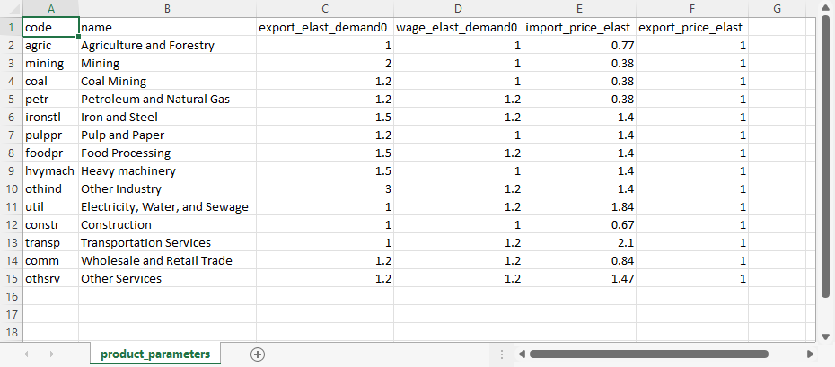
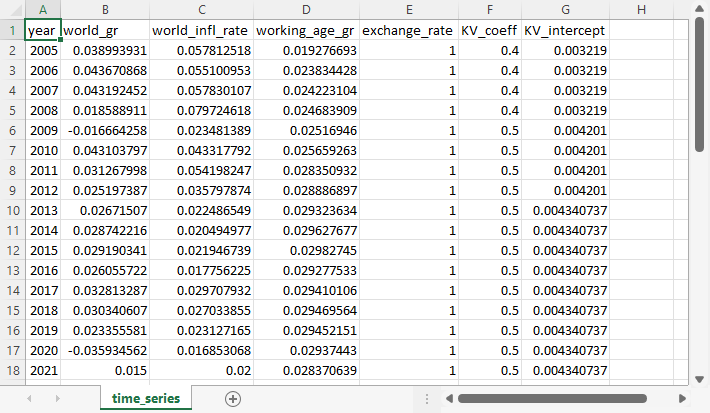

```@meta
CurrentModule = LEAPMacro
```

# [External parameter files](@id params)
External parameters that are specified for all products, all sectors, or over time, are supplied in three comma-separated variable (CSV) files in the `inputs` folder. The files provided with the Freedonia sample model have the names `product_parameters.csv`, `sector_parameters.csv`, and `time_series.csv`. However, the names are set in the configuration file's [general settings](@ref config-general-settings). That means that different external parameter files can be used for different scenarios.

The other files in the Freedonia sample model `input` folder include the [supply-use table](@ref sut) and some optional input files, which are described below.

!!! info "Comma-separated variable (CSV) files"
    CSV-formatted files are plain text files that can be viewed in a text editor. They can also be opened and modified in Excel, Google Sheets, or other spreadsheet program, which is a convenient way to edit them. 

## [Product parameters](@id params-products)
The product parameters file has the structure shown below. There are as many rows in the table as there are products.

The first two columns are the product codes and product names. These should be in the same order as the products in the [supply-use tables](@ref sut).

The next two columns provide the initial income elasticities of demand[^1] for exports (with respect to global GDP) and domestic final consumption (with respect to total wages). These elasticities change over time, as determined by additional parameters in the [configuration file](@ref config-longrun-demand-elast).

The final two columns are bracketed because they are optional. They specify how imports and exports respond to relative changes between domestic and world prices. If the columns are not present, these elasticities are set to zero by default, meaning no price sensitivity.

For more information on how Macro uses the elasticities, see the detailed explanation of [export demand and final demand](@ref dynamics-demand-fcns) and [imports](@ref dynamics-imports).

Elasticities can be estimated from historical data, although that requires knowledge of statistical methods. Otherwise, they can be drawn from published studies or from already existing economic models.

| `code` | `name` | `export_elast_demand0` | `wage_elast_demand0` | `[import_price_elast]` | `[export_price_elast]` |
|:-------|:-------|-----------------------:|---------------------:|-----------------------:|-----------------------:|
| CODE1  | Name1  |                   xe_1 |                 we_1 |              \[mpe_1\] |              \[xpe_1\] |
| CODE2  | Name2  |                   xe_2 |                 we_2 |              \[mpe_2\] |              \[xpe_2\] |
| ...    | ...    |                    ... |                  ... |                    ... |                    ... |

The corresponding [variables](@ref exog-param-vars) are:
  * `export_elast_demand0` : the initial value for ``\underline{\eta}^\text{exp}_k`` for product ``k``
  * `wage_elast_demand0` : the initial value for ``\underline{\eta}^\text{wage}_k`` for product ``k``
  * `import_price_elast` : ``\underline{\phi}^\text{imp}_k`` for product ``k``
  * `export_price_elast` : ``\underline{\phi}^\text{export}_k`` for product ``k``

Here is the example from the Freedonia sample model:


[^1]: The [income elasticity of demand](https://www.investopedia.com/terms/i/incomeelasticityofdemand.asp) and [price elasticity of demand](https://www.investopedia.com/terms/p/priceelasticity.asp) are measures of the responsiveness of demand for a good or service with respect to changes in income or price.

## [Sector parameters](@id params-sectors)
The structure of the sector parameters file is shown below. There are as many rows in the table as there are sectors.

In addition to the sector codes and names, this file contains only a single parameter for each sector, the depreciation rate. Where available, this can be calculated from national statistics. Otherwise, the `delta` parameter reported for the whole economy in the [Penn World Table](https://www.rug.nl/ggdc/productivity/pwt/) can be applied to each sector.

| `code`      | `name`       | `depr_rate` |
|:------------|:-------------|------------:|
| CODE1       | Name 1       |        dr_1 |
| CODE2       | Name 2       |        dr_2 |
| ...         | ...          |         ... |

The corresponding [variable](@ref exog-param-vars) is:
  * `depr_rate` : ``\underline{\delta}_i`` for sector ``i``

Here is the example from the Freedonia sample model:


## [Time series](@id params-time-series)
The structure of the time series file is shown below. It contains several parameters: the world growth rate, the world inflation rate, the growth rate of the working-age population, the exchange rate, and parameters for the [labor productivity calculation](@ref dynamics-wages-labor-prod).

!!! info "Exchange rates and supply-use tables"
    Supply-use tables have entries that are all in the same currency, usually but not always the national (domestic) currency. Exchange rates express the domestic currency in terms of a foreign currency, such as the US dollar, the Euro, the Yen, or a mixture of currencies (a currency "basket"). In Macro, exchange rates are converted into an index to ensure consistent currency units.

Scenarios for the world economic growth rate can be drawn from other studies, such as the [Shared Socioeconomic Pathways (SSP) database](https://tntcat.iiasa.ac.at/SspDb/dsd?Action=htmlpage&page=about). The working age growth rate can be calculated from national projections or the [UN Population Prospects database](https://population.un.org/wpp/Download/Standard/Population/).

Other parameters have less well-established sources of estimates. The labor productivity parameters (the Kaldor-Verdoorn parameters `KV_coeff` and `KV_intercept`) might well be assumed constant, possibly estimated from historical data or drawn from studies such as [Estimating Kaldor-Verdoorn’s law across countries in different stages of development](https://www.anpec.org.br/encontro/2014/submissao/files_I/i9-0ed7d252394aed6039f6af0e4ed51fc6.pdf) by Guilherme Magacho. Assumptions regarding the world inflation rate and the exchange rate can be based on historical patterns, other modeling studies, or consultation with experts.

NOTE: THE KV COLUMNS CAN BE OMITTED

| `year` | `world_gr` | `world_infl_rate` | `working_age_gr` | `exchange_rate` | `KV_coeff` | `KV_intercept` |
|-------:|-----------:|------------------:|-----------------:|----------------:|-----------:|---------------:|
|    y_1 |      wgr_1 |             wir_1 |           wagr_1 |            xr_1 |      kvc_1 |          kvi_1 |
|    y_2 |      wgr_2 |             wir_2 |           wagr_2 |            xr_2 |      kvc_2 |          kvi_2 |
|    ... |        ... |               ... |              ... |             ... |        ... |            ... |
|  y_*N* |    wgr_*N* |           wir_*N* |         wagr_*N* |          xr_*N* |    kvc_*N* |        kvi_*N* |

The corresponding [variables](@ref exog-param-vars) are:
  * `world_gr` : ``\underline{\gamma}^\text{world}``
  * `world_infl_rate` : ``\underline{\pi}_{w,k}`` for sector ``k`` (but assumed to be the same for all products)
  * `working_age_gr` : ``\underline{\hat{N}}``
  * `exchange_rate` : ``\underline{e}``
  * `KV_coeff` : ``\underline{\alpha}_\text{KV}``
  * `KV_intercept` : ``\underline{\beta}_\text{KV}``

Here is the example from the Freedonia sample model:


## [Optional input files](@id params-optional-input-files)
In the [configuration file general settings](@ref config-general-settings), it is possible to specify any or all of three optional input files for: investment demand; potential output; maximum capacity utilization; and real prices for tradeables.

### [Investment demand](@id params-optional-exog-investment)
The Macro model calculates investment for non-energy sectors based on expected demand and profitability: see the explanation of [potential output](@ref dynamics-potential-output) in the Technical Details. However, for public infrastructure investment -- which is driven by policy goals, rather than private profitability, and where the capital stock is not associated with a particular sector -- investment must be specified exogenously. (When externally specified investment *is* associated with a particular sector, it is better to specify potential output: see below.)

The investment demand parameter file has the following structure:

| `year` | `addl_investment` |
|-------:|------------------:|
|    y_1 |             inv_1 |
|    y_2 |             inv_2 |
|    ... |               ... |

Note that not all years need to be included. For example, if there is investment expenditure in 2025, but not in 2026, then the year 2026 does not have to be included in the file. The values are in "real" monetary terms, and are used directly by Macro, so the units should be the same as those for the supply and use tables.

### Potential output
In the Macro model, potential output is determined by investment: see [potential output](@ref dynamics-potential-output) in the Technical Details. In some cases, it is best to override this behavior. For example, output from agriculture might be determined by an external crop model, or the output from the mining sector might be constrained by the availability of the ore. In other cases, the production level might be set as a policy target or through a sector-specific planning document. In these cases, potential output can be specified for specific sectors, and Macro will calculate investment.

The potential output parameter file has the following structure:

| `year` |       `sec_1` |       `sec_2` | ... |
|-------:|--------------:|--------------:|----:|
|    y_1 |   potout_s1y1 |   potout_s2y1 | ... |
|    y_2 |   potout_s1y2 |   potout_s2y2 | ... |
|    ... |           ... |           ... | ... |
|  y_*N* | potout_s1y*N* | potout_s2y*N* | ... |

The sequence of values is converted internally into an index. For this reason, **values must be specified for all years**. However, **values should be specified only for sectors with exogenous potential output**. Other sectors, where Macro simulates the change in potential output, should not appear in this file.

### [Maximum capacity utilization](@id params-optional-max-utilization)
Capacity utilization in the Macro model is determined in each time step by solving a [linear goal program](@ref lgp). By default, maximum capacity utilization is equal to 1.0. However, in some cases, capacity utilization might be constrained. For example, during a disease outbreak, some service sector activities may be limited, and during a drought, manufacturing plants that rely on cooling or process water might have to curtail production. In these cases, a maximum level of capacity utilization less than one can be specified exogenously.

The maximum capacity utilization file has the following structure:

| `year` |     `sec_1` |     `sec_2` | ... |
|-------:|------------:|------------:|----:|
|    y_1 |   umax_s1y1 |   umax_s2y1 | ... |
|    y_2 |   umax_s1y2 |             | ... |
|    y_3 |   umax_s1y3 |   umax_s2y3 | ... |
|    ... |         ... |         ... | ... |
|  y_*N* | umax_s1y*N* | umax_s2y*N* | ... |

In the file, all years must be listed. However, values do not have to specified for all years. As indicated in the table for sector 2 and year 2 (cell `y_2`,`sec_2`), if capacity utilization is unconstrained in some year, the maximum level can be omitted, and Macro will set it equal to 1.0.

### [Real price trends for selected tradeables](@id params-optional-price-trend)
The Macro model assumes that countries are price takers in world markets, and prices for tradeables are exogenous. The domestic prices of tradeables could literally be the world price, but the fundamental assumption is that domestic producers are price takers for tradeables, whereas for non-tradeables they set prices as a markup on costs.

By default, prices for all tradeables grow at a uniform, user-specified world inflation rate. However, optionally, real price indices for all or some tradeables can be specified. The real price trend is then adjusted for inflation at the world inflation rate.

The real price file has the following structure:

| `year` |  `prod_1` |  `prod_2` | ... |
|-------:|----------:|----------:|----:|
|    y_1 |   pw_p1y1 |   pw_p2y1 | ... |
|    y_2 |   pw_p1y2 |   pw_p2y2 | ... |
|    y_3 |   pw_p1y3 |   pw_p2y3 | ... |
|    ... |       ... |       ... | ... |
|  y_*N* | pw_p1y*N* | pw_p2y*N* | ... |

The sequence of values is converted internally into an index. For this reason, **values must be specified for all years**. However, **values should be specified only for products for which a real price index is specified**. For other products, the real price is assumed to be constant, so the price rises at the world inflation rate. Price indices for non-tradeables are ignored; Macro calculates those prices endogenously based on a markup. 
